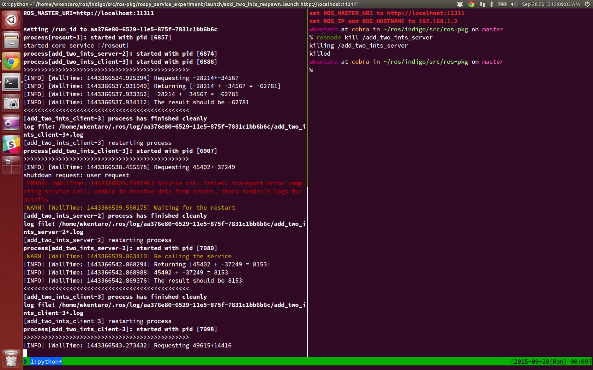

========================
rospy_service_experiment
========================

Service call when server is killed
==================================

#. Launch the server and client.
#. Kill the server node when the client is waing for response. (you can see the output of the terminal screen)
#. The client can notice the killed server and re-call the service.

.. code-block:: sh

    roslaunch rospy_service_experiment add_two_ints_respawn.launch
    rosnode kill /add_two_ints_server  # kill the server

